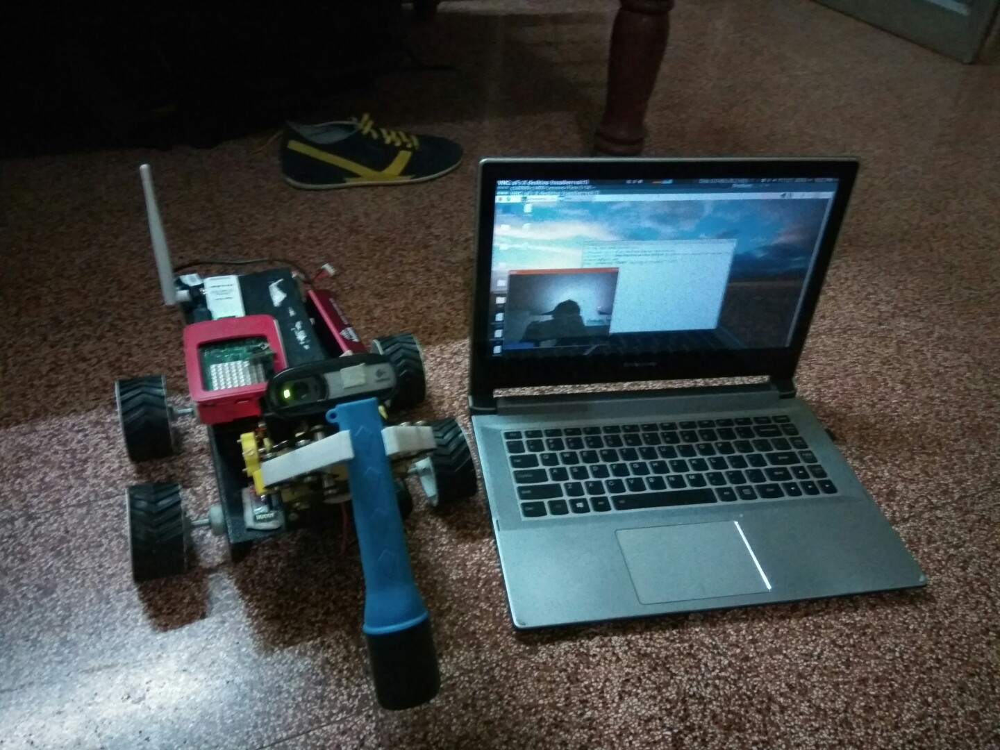

# URC2017
1)Control , deals with how we control the rover.
2)Sense , deals with the Sensory modules of the rover

 

 

#Need to work on the following modules

1)ROS integration , its important to integrate ros since most of the opensource integration of robot  revolvs around ROS for interacting with the physical/simulated robot .

2)Need to work on a better soulution for the video feed (mjpegstreammer is the best we found so far .)

#Specificatiins and challengs of Autonomous navigation.

Autonomous driving in the case of a "mars rover" would primarily have to deal with three types of challenges .

1)Terrain navigation, this deals with avoiding obstacles , trenches etc .

2)Terrain assist, this deals with problems that would occur in slippery slope.We can solve the problem using two approaches 

A) Visually guided navigation system.

B) Inertially guided navigation system.

3)Incase of communication faliure , it should come back to the last place with better communication.
